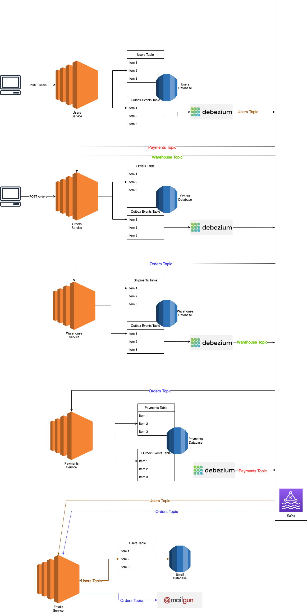

# Architecture Flow

The flow pipeline for our microservice ecosystem is the 

### Quick start

1. Navigate to terraform folder and run following cmds:

```shell
terraform init
terraform apply
```

2. Navigate to kubernetes folder, deploy images to EKS using the following cmd:

```shell
bash deploy-k8s.sh
```

3. Make a request to create databases using Bastion POST /createDatabases:

4. Navigate to kubernetes folder, and deploy debezium image to EKS.